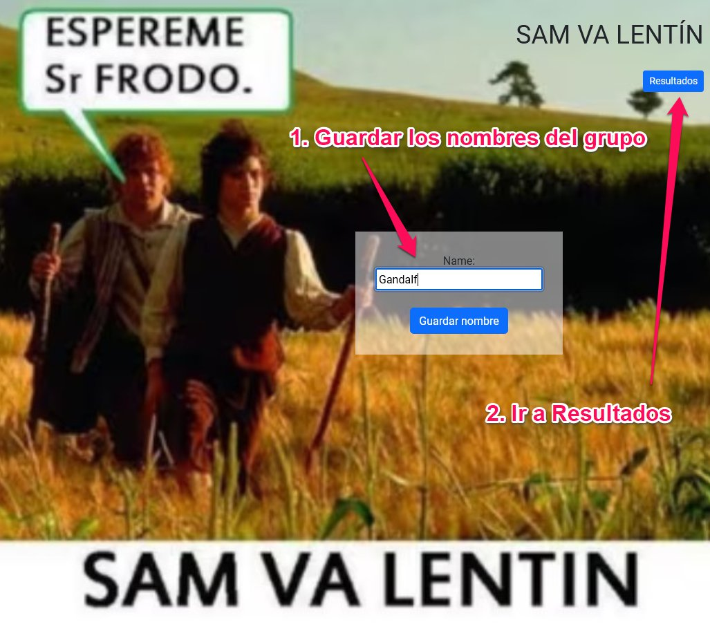
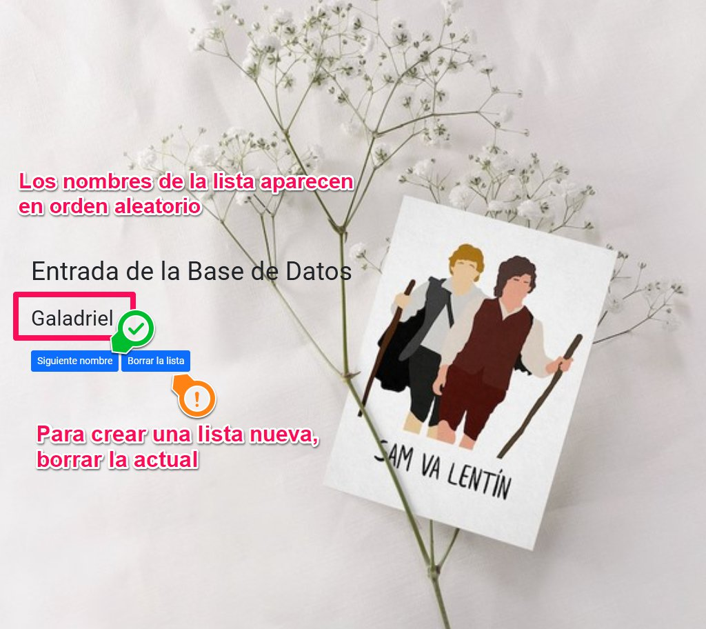

# SAM VA LENTÍN

Una aplicación exprés para el curso de _Desarrollo de aplicaciones y DevOps en Google Cloud Platform_ (2024). 

Las instrucciones eran crear una aplicación hosteable que permita agregar una lista de nombres y que después aparezcan en orden aleatorio. Debe haber un formulario para agregar los nombres, un botón para mostrarlos uno por uno y otro para borrar la lista. Tiempo máximo: 4 horas.

Una aplicación con motivo del día de San Valentín. Los alumnos traeríamos regalos de chocolate. Luego, registraríamos nuestros nombres y la aplicación determinaría a quién le tocaría cada regalo de chocolate. En mi caso, celebré que Sam Va Lentín y llevé lembas (de la marca Doritos).

Hecho con Django 5.0.1 y Python 3.12
Las imágenes pertenecen a sus respectivos dueños.